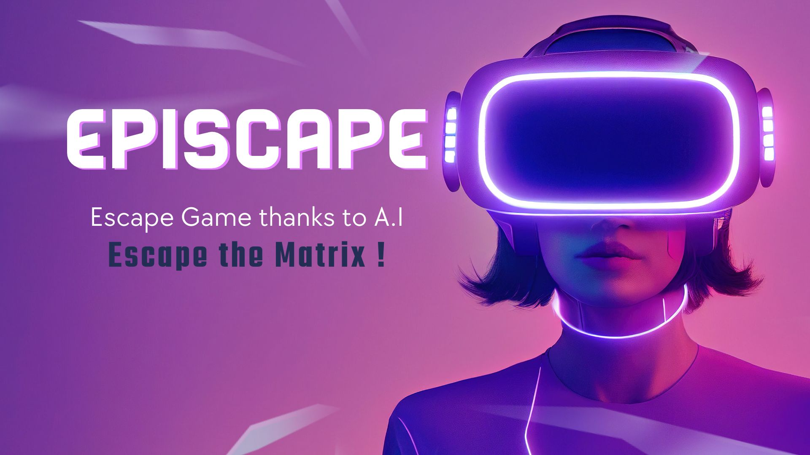
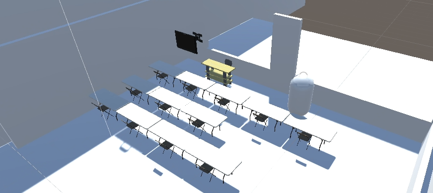

# EpiScape

## Overview

EpiScape is a digital twin project that uses Unity Sentris to create a virtual twin of an existing room. The project currently includes a model of the Assembly Room at the Epitech Barcelona Campus. Users can interact with the virtual twin to explore the room and complete escape game challenges.

## How it works

EpiScape uses Sentris to run AI models inside of Unity. The model used in the project is MNIST, which is a convolutional neural network that can recognize handwritten digits. The model is passed a Texture2D of the user's input, and then outputs an int which is compared to the right number.

## Roadblocks

One of the challenges in developing EpiScape was getting the AI model to be accurate. It's not uncommon for it to think a 8 is a 3, or a 1 is a 7.

## Next steps

The team plans to add more rooms to the virtual twin to make a real twin of the Epitech Barcelona Campus. They also plan to add more escape game challenges and use another AI model to detect drawing of objects.